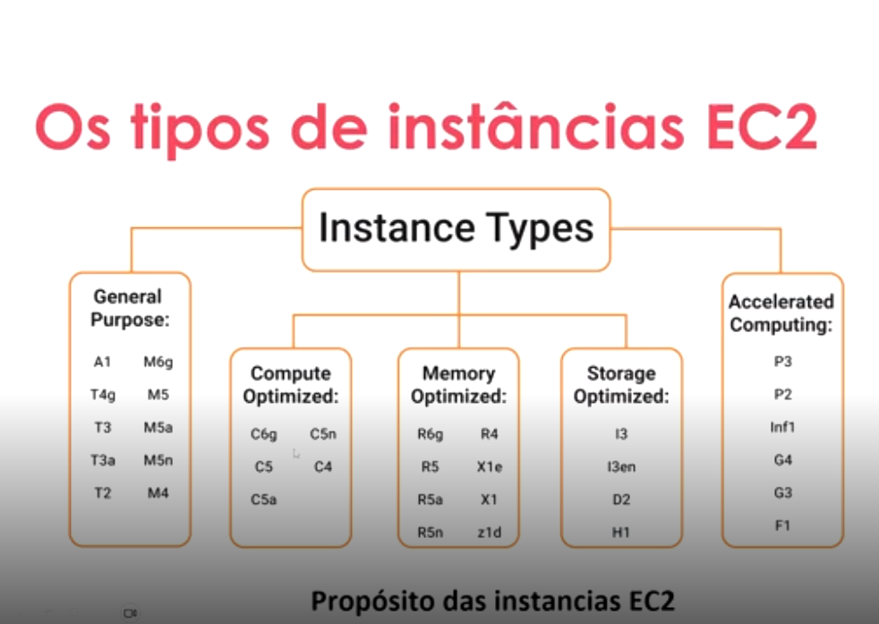
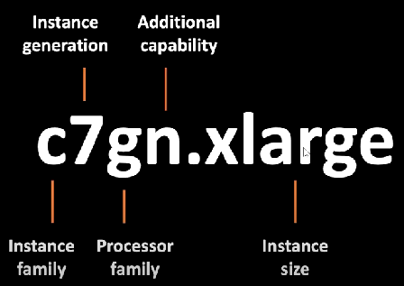

# Entendendo as Instâncias EC2 e a Otimização de Recursos na AWS

## Conteúdo programático deste curso
    ▶ Módulo 2: Computação em nuvem com EC2
        - Amazon EC2
        - Armazenamento na nuvem
        - Gerenciamento de instâncias

### EC2 - Elastic Compute Cloud, são máquinas virtuais na AWS, podendo ser com sistema operacional Windows ou Linux.

### Uma EC2 é comporta por:
    - CPU
    - Memória
    - Disco
    - Rede
    - Sistema Operacional

### Instâncias EC2:
    No modelo Cloud, uma EC2 é do tipo IAAS ou seja, quando criamos um EC2 estamos utilizando o tipo de infraestrutura como serviço. Neste serviço, a responsabilidade do cliente é gerenciar os aplicativos, dados e conexões.

### Tipos de instâncias EC2:

| General Purpose | Compute Optimised | Memory Optimised | Accelerated Computing | Storage Optimised |
|:---------:|:--------:|:--------:|:--------:|:--------:|
|A1 - ARM based core and custom silicon|C4 - Compute: CPU intensive apps and DBs|R4 - RAM: Memory intensive apps and DBs|P2 - Processing optimised: Machine Learning|H1 - High Disk Throughput: Big data clusters|
|T2 - Tiny: web servers and small DBs|_|X1 - Xtreme RAM: For SAP/Spark|G3 - Graphics intensive: Video and Streaming|I3 - IOPS: No SQL DBs|
|M4 - App servers and general purpose|_|z1d - High Compute and High Memory: Gaming|F1 - Field Programmable: Hardware acceleration|D2 - Dense Storage: Data Warehousing|

## Outra forma de enxergar os tipos de instâncias

## Convenção dos nomes dos tipos de instâncias 

### Otimização de recursos
    - Escalar Horizontalmente: aumentar o número de recursos. Por exemplo, adicionando mais disco rígido, adicionando mais uma instância para suportar a aplicação.
    - Escalar Verticalmente: acrescentar ou reduzir a capacidade de um recurso em um mesmo nó e geralmente está relacionado a alterar o número de vCPUs, memória, rede de uma instância.

    1. Sob demanda
       - compradas a uma taxa fixa por hora
       - carga de trabalho irregular e de curto prazo
       - não podem ser interrompidas
       - adequado para uso de testes de apps
    2. Instâncias reservadas
       - mais baratas que on-demand
       - paga pelo ano inteiro de uso
       - uso com frequência
    3. Instância SPOT
       - desconto de até 90%
       - pode ser encerrada a qualquer momento, com aviso de 2 minutos
    4. 